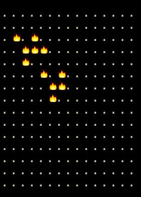

# Conways Game of Life Clojure

I'm pretty new to Clojure and decided to try solve Conway's Game of Life in it.
This was my first attempt without looking at any other implementations!

Please submit a PR if you can spot any improvements.

## Installation

`lein deps`

## Start the game

Create your own start positions or use the default and run:

`lein run`

## Developing

If you use Vim / Tmux, you can bind the following key to load all the files.
Open a Tmux split below your editor and run `lein repl`

Map the following key (I used x) to load all the files and run the tests.

```
nnoremap <leader>x :silent !tmux send-keys -t 2 "(require '[clojure.test :refer [run-tests]]) (require 'conways-gol.core :reload) (require 'conways-gol.console-renderer :reload) (require 'conways-gol.start-patterns :reload) (require 'conways-gol.core-test :reload) (run-tests 'conways-gol.core-test)" C-m<cr><cr>
```



